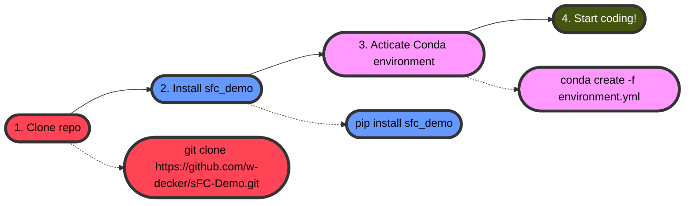

# sFC-Demo

This repository includes code to calculate static functional connectivity (sFC) from functional magnetic resonance imaging (fMRI) data. 

## Files

[`main.ipynb`](/main.ipynb) - Step-by-step deployment of code.

[`environment.yml`](/environment.yml) - Conda environment.

## Dependencies

This code relies mostly on `nilearn`. Installation instructions and/or usage can be found [here](https://nilearn.github.io/stable/index.html).

## Using this repo

A "package" has been built specifically for this analysis demonstration. To get the package to use this notebook, first clone this entire repository.

```bash
git clone https://github.com/w-decker/sFC-Demo.git
cd sFC-Demo
```

Install the package.

```bash
pip install sfc_demo
```

You can now import the functionality to any future code.

```py
from sfc_demo.simulate import FuncData
```

A conda environment, `sfc-demo`, has also been created specifically for this repository. To activate it, execute the code below.

```bash
conda create -f environment.yml
conda activate sfc-demo
```
> You must be in the root directory of this repository to activate the conda environment.

## Only getting the "package"

If you only want to access the package, `sfc-demo`, then execute the following code.

```bash
pip install git+https://github.com/w-decker/sFC-Demo.git@main#subdirectory=sfc_demo
```

## Workflow




